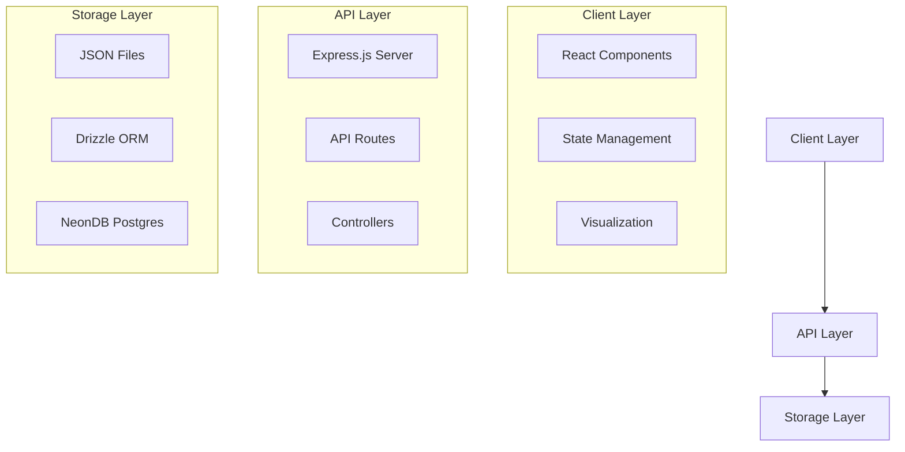
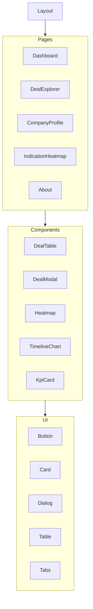
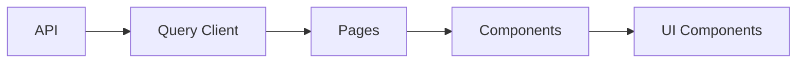

# System Patterns: Competitive Deal Radar

## System Architecture

The Competitive Deal Radar follows a modern web application architecture with clear separation of concerns:

### Client Layer
- React components for UI rendering
- React Query for server state management
- D3.js and Recharts for data visualization
- Tailwind CSS with shadcn/ui for styling

### API Layer
- Express.js server for handling requests
- RESTful API endpoints for data access
- Controllers for business logic

### Storage Layer
- JSON files for MVP data storage
- Drizzle ORM for database interactions
- NeonDB (serverless Postgres) for production data

## Key Technical Decisions

### 1. React + TypeScript
**Decision**: Use React with TypeScript for the frontend.
**Rationale**: 
- Type safety reduces runtime errors
- Improved developer experience with autocomplete and documentation
- Better maintainability for complex data structures
- Enhanced refactoring capabilities

### 2. Tailwind CSS + shadcn/ui
**Decision**: Use Tailwind CSS with shadcn/ui components.
**Rationale**:
- Rapid UI development with utility classes
- Consistent design system
- Reduced CSS overhead
- Accessible components out of the box
- Customizable to match brand requirements

### 3. Vite Build System
**Decision**: Use Vite instead of Create React App.
**Rationale**:
- Significantly faster development server
- Optimized production builds
- Better HMR (Hot Module Replacement)
- Modern ESM-based approach

### 4. React Query for Data Fetching
**Decision**: Use React Query for API data management.
**Rationale**:
- Automatic caching and background refetching
- Loading and error states management
- Pagination and infinite scrolling support
- Optimistic updates for better UX

### 5. Express.js Backend
**Decision**: Use Express.js for the backend API.
**Rationale**:
- Lightweight and flexible
- Extensive middleware ecosystem
- Easy to integrate with various databases
- Good TypeScript support

### 6. Drizzle ORM with NeonDB
**Decision**: Use Drizzle ORM with NeonDB for database operations.
**Rationale**:
- Type-safe database queries
- Serverless Postgres for scalability
- SQL-first approach for complex queries
- Minimal ORM overhead

## Design Patterns in Use

### 1. Component Composition
React components are designed to be composable, with smaller, focused components combined to create complex interfaces.

### 2. Container/Presentation Pattern
Separation between container components (handling data and state) and presentation components (handling UI rendering).

### 3. Custom Hooks
Encapsulation of reusable logic in custom hooks, such as:
- `use-mobile.tsx` for responsive design logic
- `use-toast.ts` for toast notifications

### 4. Context API
Used for global state that needs to be accessed by multiple components without prop drilling.

### 5. Render Props
Used in certain components to allow for flexible rendering strategies.

### 6. Controlled Components
Form elements and interactive components maintain state in React rather than DOM.

## Component Relationships

### Core Component Structure

### Data Flow

### State Management

1. **Server State**: Managed by React Query
   - Deals data
   - Company information
   - Indication data
   - Modality information

2. **UI State**: Managed by React's useState and useReducer
   - Filter selections
   - Modal open/close states
   - Tab selections
   - Form inputs

3. **Responsive State**: Custom hooks for device-specific rendering
   - `use-mobile.tsx` for responsive design decisions

## Error Handling Strategy

1. **API Error Handling**: React Query error states with fallbacks
2. **UI Error Boundaries**: Prevent entire app crashes from component errors
3. **Form Validation**: Client-side validation before submission
4. **Graceful Degradation**: Fallback UI when data is unavailable

## Performance Optimization Patterns

1. **Code Splitting**: Lazy loading of routes and heavy components
2. **Memoization**: Using React.memo, useMemo, and useCallback for expensive operations
3. **Virtualization**: For long lists in the Deal Explorer
4. **Asset Optimization**: Optimized images and SVGs
5. **Bundle Size Management**: Monitoring and limiting dependencies